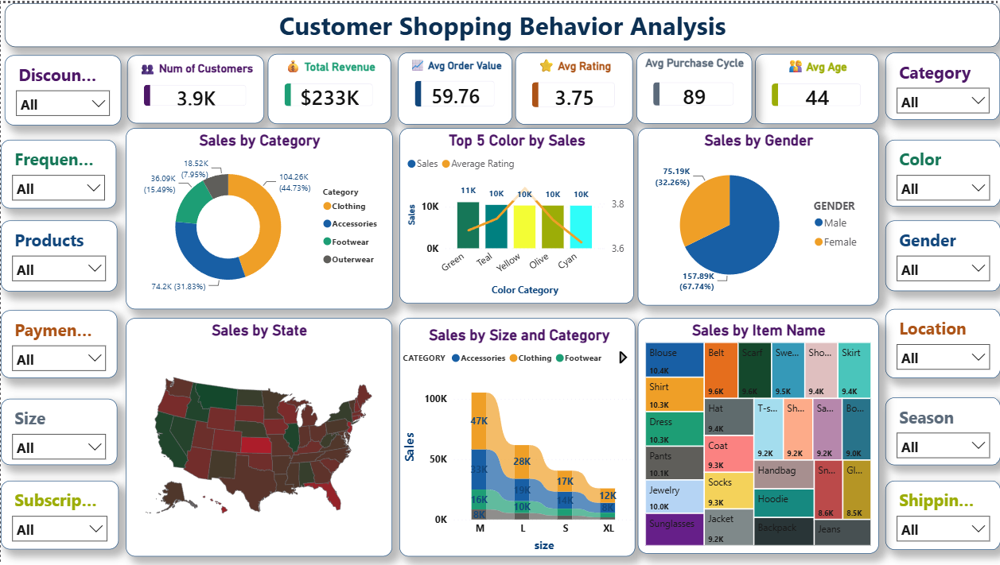

# Customer Shopping Behavior Analysis

End-to-end retail analytics project analyzing 3,900 customer transactions to uncover revenue drivers, discount patterns, shipping impact, and customer loyalty behavior — from raw data to a stakeholder-ready dashboard.

**Tools:** Python (Pandas) · SQL (Oracle) · Power BI
**Dataset:** 3,900 rows · 19 columns · Kaggle

---

## 📌 Business Problem

A fashion retailer had raw transaction-level data but no consolidated view of what was actually driving revenue — gender, subscriptions, discounts, shipping type, age, product category. Too many variables, no clear prioritization for merchandising or marketing decisions.

**Goal:** Clean the data, answer 10 concrete business questions in SQL, and build a dashboard stakeholders can use without needing to write a query.

---

## 🔧 Workflow

```
Raw CSV (Kaggle)
      │
      ▼
Python (Pandas) — cleaning & feature engineering
      │
      ▼
Oracle SQL — 10 business questions
      │
      ▼
Power BI — interactive executive dashboard
```

---

## 🧹 Data Cleaning & Feature Engineering (Python)

- Imputed missing `review_rating` values using the **median rating within each product category** (not a global median)
- Standardized all column names to lowercase snake_case
- Engineered `age_group`: quartile-based segmentation (Young Adult, Adult, Middle-aged, Senior) so each group represents a genuine quarter of the customer base
- Engineered `purchase_frequency_days`: converted categorical frequency labels (Weekly, Monthly, Annually, etc.) into numeric day intervals
- Identified and removed `promo_code_used` — found to be 100% identical to `discount_applied`

**Result:** 3,900 rows, 19 columns, 0 missing values.

📓 Full notebook: [Kaggle Notebook](#) *(add link)*
📊 Cleaned dataset: [Kaggle Dataset](#) *(add link)*

---

## 🗃️ Business Analysis (SQL)

10 business questions answered in Oracle SQL — see [`customer_behavior.sql`](./customer_behavior.sql) for all queries.

| # | Question | Key Finding |
|---|---|---|
| 1 | Revenue by gender | Male: $157,890 (67.7%) · Female: $75,191 (32.3%) |
| 2 | High-value customers still using discounts | Isolated price-sensitive but high-intent segment |
| 3 | Top 5 highest-rated products | Gloves, Sandals, Boots, Hats, Skirts |
| 4 | Standard vs Express shipping AOV | Express $60.48 vs Standard $58.46 (+3.5%) |
| 5 | Do subscribers spend more? | No — non-subscribers spend slightly more per order |
| 6 | Products with highest discount penetration | Hats, Sneakers, Coats, Sweaters, Pants (~47–50%) |
| 7 | Customer segmentation by purchase history | Loyal 79.9% · Returning 18.0% · New 2.1% |
| 8 | Top 3 products per category | Window function ranking (`ROW_NUMBER()`) |
| 9 | Repeat buyers vs subscription rate | Only 27.6% of repeat buyers (5+) are subscribed |
| 10 | Revenue by age group | Fairly even spread; Young Adults slightly lead |

---

## 📊 Dashboard (Power BI)

Interactive executive dashboard with filters across category, gender, location, discount, size, payment, season, and shipping type — built so stakeholders can self-serve insights without a new query for every question.




**Key panels:**
- KPI strip — customers, total revenue, avg order value, avg rating
- Sales by Category, Gender, State (map)
- Sales by Size & Category (trend)
- Top 5 Colors by Sales & Rating
- Sales by Item Name (treemap)

---

## 💡 Key Recommendations

1. **Rethink the subscription program** — it doesn't correlate with higher spend and isn't capturing the most loyal (5+ purchase) customers. Reposition it around retention perks rather than treating it as a revenue lever.
2. **Review discount depth** on Hats, Sneakers, Coats, Sweaters, and Pants — near-50% discount penetration is a margin risk worth investigating.
3. **Use Express shipping as an upsell** — the ~3.5% higher AOV suggests promoting it at checkout has revenue upside.
4. **Prioritize retention over acquisition** — ~80% of the customer base is already "Loyal," so marketing spend is better directed at deepening existing customer value.

---

## 📁 Repository Structure

```
├── customer_behavior.sql              # All 10 SQL business questions
├── customer_shopping_behavior_cleaned.csv   # Cleaned dataset
├── Customer_behavior_analysis_dashboard.png              # Power BI dashboard screenshot
└── README.md
```

---

## 🔗 Project Links

- **Kaggle Dataset:** [link]
- **Kaggle Notebook:** [link]
---

## 👤 About

Built as an independent project to practice a full analytics workflow the way it's done for a real retail business — clean the data, ask sharp business questions, and present findings a non-technical stakeholder can act on.

**Connect:** [LinkedIn](#) · [Kaggle Profile](#)
